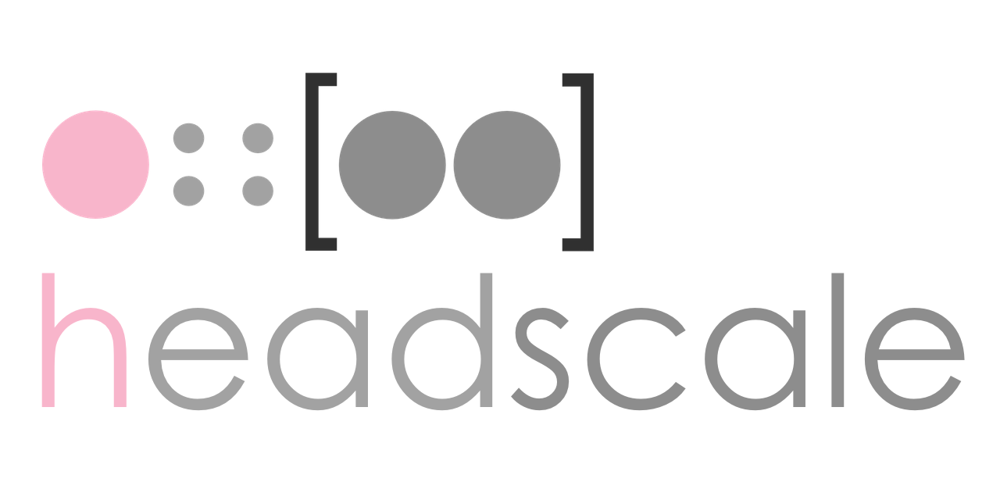

An open source, self-hosted implementation of the Tailscale control server.

Join our [Discord](https://discord.gg/c84AZQhmpx) server for a chat.

**Note:** Always select the same GitHub tag as the released version you use
to ensure you have the correct example configuration and documentation.
The `main` branch might contain unreleased changes.

## What is Tailscale

Tailscale is [a modern VPN](https://tailscale.com/) built on top of
[Wireguard](https://www.wireguard.com/).
It [works like an overlay network](https://tailscale.com/blog/how-tailscale-works/)
between the computers of your networks - using
[NAT traversal](https://tailscale.com/blog/how-nat-traversal-works/).

Everything in Tailscale is Open Source, except the GUI clients for proprietary OS
(Windows and macOS/iOS), and the control server.

The control server works as an exchange point of Wireguard public keys for the
nodes in the Tailscale network. It assigns the IP addresses of the clients,
creates the boundaries between each user, enables sharing machines between users,
and exposes the advertised routes of your nodes.

A [Tailscale network (tailnet)](https://tailscale.com/kb/1136/tailnet/) is private
network which Tailscale assigns to a user in terms of private users or an
organisation.

## Design goal

Headscale aims to implement a self-hosted, open source alternative to the Tailscale
control server.
Headscale's goal is to provide self-hosters and hobbyists with an open-source
server they can use for their projects and labs.
It implements a narrow scope, a single Tailnet, suitable for a personal use, or a small
open-source organisation.

## Supporting Headscale

If you like `headscale` and find it useful, there is a sponsorship and donation
buttons available in the repo.

## Features

- Full "base" support of Tailscale's features
- Configurable DNS
  - [Split DNS](https://tailscale.com/kb/1054/dns/#using-dns-settings-in-the-admin-console)
- Node registration
  - Single-Sign-On (via Open ID Connect)
  - Pre authenticated key
- Taildrop (File Sharing)
- [Access control lists](https://tailscale.com/kb/1018/acls/)
- [MagicDNS](https://tailscale.com/kb/1081/magicdns)
- Support for multiple IP ranges in the tailnet
- Dual stack (IPv4 and IPv6)
- Routing advertising (including exit nodes)
- Ephemeral nodes
- Embedded [DERP server](https://tailscale.com/blog/how-tailscale-works/#encrypted-tcp-relays-derp)

## Client OS support

| OS      | Supports headscale                                        |
| ------- | --------------------------------------------------------- |
| Linux   | Yes                                                       |
| OpenBSD | Yes                                                       |
| FreeBSD | Yes                                                       |
| macOS   | Yes (see `/apple` on your headscale for more information) |
| Windows | Yes [docs](./docs/windows-client.md)                      |
| Android | Yes [docs](./docs/android-client.md)                      |
| iOS     | Yes [docs](./docs/iOS-client.md)                          |

## Running headscale

**Please note that we do not support nor encourage the use of reverse proxies
and container to run Headscale.**

Please have a look at the [`documentation`](https://headscale.net/).

## Talks

- Fosdem 2023 (video): [Headscale: How we are using integration testing to reimplement Tailscale](https://fosdem.org/2023/schedule/event/goheadscale/)
  - presented by Juan Font Alonso and Kristoffer Dalby

## Disclaimer

1. This project is not associated with Tailscale Inc.
2. The purpose of Headscale is maintaining a working, self-hosted Tailscale control panel.

## Contributing

Headscale is "Open Source, acknowledged contribution", this means that any
contribution will have to be discussed with the Maintainers before being submitted.

This model has been chosen to reduce the risk of burnout by limiting the
maintenance overhead of reviewing and validating third-party code.

Headscale is open to code contributions for bug fixes without discussion.

If you find mistakes in the documentation, please submit a fix to the documentation.

### Requirements

To contribute to headscale you would need the lastest version of [Go](https://golang.org)
and [Buf](https://buf.build)(Protobuf generator).

We recommend using [Nix](https://nixos.org/) to setup a development environment. This can
be done with `nix develop`, which will install the tools and give you a shell.
This guarantees that you will have the same dev env as `headscale` maintainers.

### Code style

To ensure we have some consistency with a growing number of contributions,
this project has adopted linting and style/formatting rules:

The **Go** code is linted with [`golangci-lint`](https://golangci-lint.run) and
formatted with [`golines`](https://github.com/segmentio/golines) (width 88) and
[`gofumpt`](https://github.com/mvdan/gofumpt).
Please configure your editor to run the tools while developing and make sure to
run `make lint` and `make fmt` before committing any code.

The **Proto** code is linted with [`buf`](https://docs.buf.build/lint/overview) and
formatted with [`clang-format`](https://clang.llvm.org/docs/ClangFormat.html).

The **rest** (Markdown, YAML, etc) is formatted with [`prettier`](https://prettier.io).

Check out the `.golangci.yaml` and `Makefile` to see the specific configuration.

### Install development tools

- Go
- Buf
- Protobuf tools

Install and activate:

```shell
nix develop
```

### Testing and building

Some parts of the project require the generation of Go code from Protobuf
(if changes are made in `proto/`) and it must be (re-)generated with:

```shell
make generate
```

**Note**: Please check in changes from `gen/` in a separate commit to make it easier to review.

To run the tests:

```shell
make test
```

To build the program:

```shell
nix build
```

or

```shell
make build
```

## Contributors

<table>
<tr>
    <td align="center" style="word-wrap: break-word; width: 150.0; height: 150.0">
        <a href=https://github.com/kradalby>
            
            <br />
            <sub style="font-size:14px"><b>Kristoffer Dalby</b></sub>
        </a>
    </td>
    <td align="center" style="word-wrap: break-word; width: 150.0; height: 150.0">
        <a href=https://github.com/juanfont>
            
            <br />
            <sub style="font-size:14px"><b>Juan Font</b></sub>
        </a>
    </td>
    <td align="center" style="word-wrap: break-word; width: 150.0; height: 150.0">
        <a href=https://github.com/restanrm>
            
            <br />
            <sub style="font-size:14px"><b>Adrien Raffin-Caboisse</b></sub>
        </a>
    </td>
    <td align="center" style="word-wrap: break-word; width: 150.0; height: 150.0">
        <a href=https://github.com/cure>
            
            <br />
            <sub style="font-size:14px"><b>Ward Vandewege</b></sub>
        </a>
    </td>
    <td align="center" style="word-wrap: break-word; width: 150.0; height: 150.0">
        <a href=https://github.com/huskyii>
            
            <br />
            <sub style="font-size:14px"><b>Jiang Zhu</b></sub>
        </a>
    </td>
    <td align="center" style="word-wrap: break-word; width: 150.0; height: 150.0">
        <a href=https://github.com/tsujamin>
            
            <br />
            <sub style="font-size:14px"><b>Benjamin Roberts</b></sub>
        </a>
    </td>
</tr>
<tr>
    <td align="center" style="word-wrap: break-word; width: 150.0; height: 150.0">
        <a href=https://github.com/reynico>
            
            <br />
            <sub style="font-size:14px"><b>Nico</b></sub>
        </a>
    </td>
    <td align="center" style="word-wrap: break-word; width: 150.0; height: 150.0">
        <a href=https://github.com/evenh>
            
            <br />
            <sub style="font-size:14px"><b>Even Holthe</b></sub>
        </a>
    </td>
    <td align="center" style="word-wrap: break-word; width: 150.0; height: 150.0">
        <a href=https://github.com/e-zk>
            
            <br />
            <sub style="font-size:14px"><b>e-zk</b></sub>
        </a>
    </td>
    <td align="center" style="word-wrap: break-word; width: 150.0; height: 150.0">
        <a href=https://github.com/ImpostorKeanu>
            
            <br />
            <sub style="font-size:14px"><b>Justin Angel</b></sub>
        </a>
    </td>
    <td align="center" style="word-wrap: break-word; width: 150.0; height: 150.0">
        <a href=https://github.com/ItalyPaleAle>
            
            <br />
            <sub style="font-size:14px"><b>Alessandro (Ale) Segala</b></sub>
        </a>
    </td>
    <td align="center" style="word-wrap: break-word; width: 150.0; height: 150.0">
        <a href=https://github.com/ohdearaugustin>
            
            <br />
            <sub style="font-size:14px"><b>ohdearaugustin</b></sub>
        </a>
    </td>
</tr>
<tr>
    <td align="center" style="word-wrap: break-word; width: 150.0; height: 150.0">
        <a href=https://github.com/mpldr>
            
            <br />
            <sub style="font-size:14px"><b>Moritz Poldrack</b></sub>
        </a>
    </td>
    <td align="center" style="word-wrap: break-word; width: 150.0; height: 150.0">
        <a href=https://github.com/Orhideous>
            
            <br />
            <sub style="font-size:14px"><b>Andriy Kushnir</b></sub>
        </a>
    </td>
    <td align="center" style="word-wrap: break-word; width: 150.0; height: 150.0">
        <a href=https://github.com/GrigoriyMikhalkin>
            
            <br />
            <sub style="font-size:14px"><b>GrigoriyMikhalkin</b></sub>
        </a>
    </td>
    <td align="center" style="word-wrap: break-word; width: 150.0; height: 150.0">
        <a href=https://github.com/christian-heusel>
            
            <br />
            <sub style="font-size:14px"><b>Christian Heusel</b></sub>
        </a>
    </td>
    <td align="center" style="word-wrap: break-word; width: 150.0; height: 150.0">
        <a href=https://github.com/mike-lloyd03>
            
            <br />
            <sub style="font-size:14px"><b>Mike Lloyd</b></sub>
        </a>
    </td>
    <td align="center" style="word-wrap: break-word; width: 150.0; height: 150.0">
        <a href=https://github.com/iSchluff>
            
            <br />
            <sub style="font-size:14px"><b>Anton Schubert</b></sub>
        </a>
    </td>
</tr>
<tr>
    <td align="center" style="word-wrap: break-word; width: 150.0; height: 150.0">
        <a href=https://github.com/Niek>
            
            <br />
            <sub style="font-size:14px"><b>Niek van der Maas</b></sub>
        </a>
    </td>
    <td align="center" style="word-wrap: break-word; width: 150.0; height: 150.0">
        <a href=https://github.com/negbie>
            
            <br />
            <sub style="font-size:14px"><b>Eugen Biegler</b></sub>
        </a>
    </td>
    <td align="center" style="word-wrap: break-word; width: 150.0; height: 150.0">
        <a href=https://github.com/617a7a>
            
            <br />
            <sub style="font-size:14px"><b>Azz</b></sub>
        </a>
    </td>
    <td align="center" style="word-wrap: break-word; width: 150.0; height: 150.0">
        <a href=https://github.com/qbit>
            
            <br />
            <sub style="font-size:14px"><b>Aaron Bieber</b></sub>
        </a>
    </td>
    <td align="center" style="word-wrap: break-word; width: 150.0; height: 150.0">
        <a href=https://github.com/kazauwa>
            
            <br />
            <sub style="font-size:14px"><b>Igor Perepilitsyn</b></sub>
        </a>
    </td>
    <td align="center" style="word-wrap: break-word; width: 150.0; height: 150.0">
        <a href=https://github.com/Aluxima>
            
            <br />
            <sub style="font-size:14px"><b>Laurent Marchaud</b></sub>
        </a>
    </td>
</tr>
<tr>
    <td align="center" style="word-wrap: break-word; width: 150.0; height: 150.0">
        <a href=https://github.com/majst01>
            
            <br />
            <sub style="font-size:14px"><b>Stefan Majer</b></sub>
        </a>
    </td>
    <td align="center" style="word-wrap: break-word; width: 150.0; height: 150.0">
        <a href=https://github.com/fdelucchijr>
            
            <br />
            <sub style="font-size:14px"><b>Fernando De Lucchi</b></sub>
        </a>
    </td>
    <td align="center" style="word-wrap: break-word; width: 150.0; height: 150.0">
        <a href=https://github.com/OrvilleQ>
            
            <br />
            <sub style="font-size:14px"><b>Orville Q. Song</b></sub>
        </a>
    </td>
    <td align="center" style="word-wrap: break-word; width: 150.0; height: 150.0">
        <a href=https://github.com/hdhoang>
            
            <br />
            <sub style="font-size:14px"><b>hdhoang</b></sub>
        </a>
    </td>
    <td align="center" style="word-wrap: break-word; width: 150.0; height: 150.0">
        <a href=https://github.com/bravechamp>
            
            <br />
            <sub style="font-size:14px"><b>bravechamp</b></sub>
        </a>
    </td>
    <td align="center" style="word-wrap: break-word; width: 150.0; height: 150.0">
        <a href=https://github.com/deonthomasgy>
            
            <br />
            <sub style="font-size:14px"><b>Deon Thomas</b></sub>
        </a>
    </td>
</tr>
<tr>
    <td align="center" style="word-wrap: break-word; width: 150.0; height: 150.0">
        <a href=https://github.com/madjam002>
            
            <br />
            <sub style="font-size:14px"><b>Jamie Greeff</b></sub>
        </a>
    </td>
    <td align="center" style="word-wrap: break-word; width: 150.0; height: 150.0">
        <a href=https://github.com/jonathanspw>
            
            <br />
            <sub style="font-size:14px"><b>Jonathan Wright</b></sub>
        </a>
    </td>
    <td align="center" style="word-wrap: break-word; width: 150.0; height: 150.0">
        <a href=https://github.com/ChibangLW>
            
            <br />
            <sub style="font-size:14px"><b>ChibangLW</b></sub>
        </a>
    </td>
    <td align="center" style="word-wrap: break-word; width: 150.0; height: 150.0">
        <a href=https://github.com/majabojarska>
            
            <br />
            <sub style="font-size:14px"><b>Maja Bojarska</b></sub>
        </a>
    </td>
    <td align="center" style="word-wrap: break-word; width: 150.0; height: 150.0">
        <a href=https://github.com/mevansam>
            
            <br />
            <sub style="font-size:14px"><b>Mevan Samaratunga</b></sub>
        </a>
    </td>
    <td align="center" style="word-wrap: break-word; width: 150.0; height: 150.0">
        <a href=https://github.com/dragetd>
            
            <br />
            <sub style="font-size:14px"><b>Michael G.</b></sub>
        </a>
    </td>
</tr>
<tr>
    <td align="center" style="word-wrap: break-word; width: 150.0; height: 150.0">
        <a href=https://github.com/ptman>
            
            <br />
            <sub style="font-size:14px"><b>Paul Tötterman</b></sub>
        </a>
    </td>
    <td align="center" style="word-wrap: break-word; width: 150.0; height: 150.0">
        <a href=https://github.com/samson4649>
            
            <br />
            <sub style="font-size:14px"><b>Samuel Lock</b></sub>
        </a>
    </td>
    <td align="center" style="word-wrap: break-word; width: 150.0; height: 150.0">
        <a href=https://github.com/loprima-l>
            
            <br />
            <sub style="font-size:14px"><b>loprima-l</b></sub>
        </a>
    </td>
    <td align="center" style="word-wrap: break-word; width: 150.0; height: 150.0">
        <a href=https://github.com/unreality>
            
            <br />
            <sub style="font-size:14px"><b>unreality</b></sub>
        </a>
    </td>
    <td align="center" style="word-wrap: break-word; width: 150.0; height: 150.0">
        <a href=https://github.com/kevin1sMe>
            
            <br />
            <sub style="font-size:14px"><b>kevinlin</b></sub>
        </a>
    </td>
    <td align="center" style="word-wrap: break-word; width: 150.0; height: 150.0">
        <a href=https://github.com/QZAiXH>
            
            <br />
            <sub style="font-size:14px"><b>Snack</b></sub>
        </a>
    </td>
</tr>
<tr>
    <td align="center" style="word-wrap: break-word; width: 150.0; height: 150.0">
        <a href=https://github.com/artemklevtsov>
            
            <br />
            <sub style="font-size:14px"><b>Artem Klevtsov</b></sub>
        </a>
    </td>
    <td align="center" style="word-wrap: break-word; width: 150.0; height: 150.0">
        <a href=https://github.com/cmars>
            
            <br />
            <sub style="font-size:14px"><b>Casey Marshall</b></sub>
        </a>
    </td>
    <td align="center" style="word-wrap: break-word; width: 150.0; height: 150.0">
        <a href=https://github.com/dbevacqua>
            
            <br />
            <sub style="font-size:14px"><b>dbevacqua</b></sub>
        </a>
    </td>
    <td align="center" style="word-wrap: break-word; width: 150.0; height: 150.0">
        <a href=https://github.com/joshuataylor>
            
            <br />
            <sub style="font-size:14px"><b>Josh Taylor</b></sub>
        </a>
    </td>
    <td align="center" style="word-wrap: break-word; width: 150.0; height: 150.0">
        <a href=https://github.com/CNLHC>
            
            <br />
            <sub style="font-size:14px"><b>LIU HANCHENG</b></sub>
        </a>
    </td>
    <td align="center" style="word-wrap: break-word; width: 150.0; height: 150.0">
        <a href=https://github.com/motiejus>
            
            <br />
            <sub style="font-size:14px"><b>Motiejus Jakštys</b></sub>
        </a>
    </td>
</tr>
<tr>
    <td align="center" style="word-wrap: break-word; width: 150.0; height: 150.0">
        <a href=https://github.com/pvinis>
            
            <br />
            <sub style="font-size:14px"><b>Pavlos Vinieratos</b></sub>
        </a>
    </td>
    <td align="center" style="word-wrap: break-word; width: 150.0; height: 150.0">
        <a href=https://github.com/SilverBut>
            
            <br />
            <sub style="font-size:14px"><b>Silver Bullet</b></sub>
        </a>
    </td>
    <td align="center" style="word-wrap: break-word; width: 150.0; height: 150.0">
        <a href=https://github.com/snh>
            
            <br />
            <sub style="font-size:14px"><b>Steven Honson</b></sub>
        </a>
    </td>
    <td align="center" style="word-wrap: break-word; width: 150.0; height: 150.0">
        <a href=https://github.com/vsychov>
            
            <br />
            <sub style="font-size:14px"><b>MichaelKo</b></sub>
        </a>
    </td>
    <td align="center" style="word-wrap: break-word; width: 150.0; height: 150.0">
        <a href=https://github.com/ratsclub>
            
            <br />
            <sub style="font-size:14px"><b>Victor Freire</b></sub>
        </a>
    </td>
    <td align="center" style="word-wrap: break-word; width: 150.0; height: 150.0">
        <a href=https://github.com/qzydustin>
            
            <br />
            <sub style="font-size:14px"><b>Zhenyu Qi</b></sub>
        </a>
    </td>
</tr>
<tr>
    <td align="center" style="word-wrap: break-word; width: 150.0; height: 150.0">
        <a href=https://github.com/t56k>
            
            <br />
            <sub style="font-size:14px"><b>thomas</b></sub>
        </a>
    </td>
    <td align="center" style="word-wrap: break-word; width: 150.0; height: 150.0">
        <a href=https://github.com/linsomniac>
            
            <br />
            <sub style="font-size:14px"><b>Sean Reifschneider</b></sub>
        </a>
    </td>
    <td align="center" style="word-wrap: break-word; width: 150.0; height: 150.0">
        <a href=https://github.com/aberoham>
            
            <br />
            <sub style="font-size:14px"><b>Abraham Ingersoll</b></sub>
        </a>
    </td>
    <td align="center" style="word-wrap: break-word; width: 150.0; height: 150.0">
        <a href=https://github.com/iFargle>
            
            <br />
            <sub style="font-size:14px"><b>Albert Copeland</b></sub>
        </a>
    </td>
    <td align="center" style="word-wrap: break-word; width: 150.0; height: 150.0">
        <a href=https://github.com/puzpuzpuz>
            
            <br />
            <sub style="font-size:14px"><b>Andrei Pechkurov</b></sub>
        </a>
    </td>
    <td align="center" style="word-wrap: break-word; width: 150.0; height: 150.0">
        <a href=https://github.com/theryecatcher>
            
            <br />
            <sub style="font-size:14px"><b>Anoop Sundaresh</b></sub>
        </a>
    </td>
</tr>
<tr>
    <td align="center" style="word-wrap: break-word; width: 150.0; height: 150.0">
        <a href=https://github.com/apognu>
            
            <br />
            <sub style="font-size:14px"><b>Antoine POPINEAU</b></sub>
        </a>
    </td>
    <td align="center" style="word-wrap: break-word; width: 150.0; height: 150.0">
        <a href=https://github.com/tony1661>
            
            <br />
            <sub style="font-size:14px"><b>Antonio Fernandez</b></sub>
        </a>
    </td>
    <td align="center" style="word-wrap: break-word; width: 150.0; height: 150.0">
        <a href=https://github.com/aofei>
            
            <br />
            <sub style="font-size:14px"><b>Aofei Sheng</b></sub>
        </a>
    </td>
    <td align="center" style="word-wrap: break-word; width: 150.0; height: 150.0">
        <a href=https://github.com/arnarg>
            
            <br />
            <sub style="font-size:14px"><b>Arnar</b></sub>
        </a>
    </td>
    <td align="center" style="word-wrap: break-word; width: 150.0; height: 150.0">
        <a href=https://github.com/awoimbee>
            
            <br />
            <sub style="font-size:14px"><b>Arthur Woimbée</b></sub>
        </a>
    </td>
    <td align="center" style="word-wrap: break-word; width: 150.0; height: 150.0">
        <a href=https://github.com/avirut>
            
            <br />
            <sub style="font-size:14px"><b>Avirut Mehta</b></sub>
        </a>
    </td>
</tr>
<tr>
    <td align="center" style="word-wrap: break-word; width: 150.0; height: 150.0">
        <a href=https://github.com/stensonb>
            
            <br />
            <sub style="font-size:14px"><b>Bryan Stenson</b></sub>
        </a>
    </td>
    <td align="center" style="word-wrap: break-word; width: 150.0; height: 150.0">
        <a href=https://github.com/yangchuansheng>
            
            <br />
            <sub style="font-size:14px"><b> Carson Yang</b></sub>
        </a>
    </td>
    <td align="center" style="word-wrap: break-word; width: 150.0; height: 150.0">
        <a href=https://github.com/kundel>
            
            <br />
            <sub style="font-size:14px"><b>Darrell Kundel</b></sub>
        </a>
    </td>
    <td align="center" style="word-wrap: break-word; width: 150.0; height: 150.0">
        <a href=https://github.com/fatih-acar>
            
            <br />
            <sub style="font-size:14px"><b>fatih-acar</b></sub>
        </a>
    </td>
    <td align="center" style="word-wrap: break-word; width: 150.0; height: 150.0">
        <a href=https://github.com/fkr>
            
            <br />
            <sub style="font-size:14px"><b>Felix Kronlage-Dammers</b></sub>
        </a>
    </td>
    <td align="center" style="word-wrap: break-word; width: 150.0; height: 150.0">
        <a href=https://github.com/felixonmars>
            
            <br />
            <sub style="font-size:14px"><b>Felix Yan</b></sub>
        </a>
    </td>
</tr>
<tr>
    <td align="center" style="word-wrap: break-word; width: 150.0; height: 150.0">
        <a href=https://github.com/gabe565>
            
            <br />
            <sub style="font-size:14px"><b>Gabe Cook</b></sub>
        </a>
    </td>
    <td align="center" style="word-wrap: break-word; width: 150.0; height: 150.0">
        <a href=https://github.com/JJGadgets>
            
            <br />
            <sub style="font-size:14px"><b>JJGadgets</b></sub>
        </a>
    </td>
    <td align="center" style="word-wrap: break-word; width: 150.0; height: 150.0">
        <a href=https://github.com/hrtkpf>
            
            <br />
            <sub style="font-size:14px"><b>hrtkpf</b></sub>
        </a>
    </td>
    <td align="center" style="word-wrap: break-word; width: 150.0; height: 150.0">
        <a href=https://github.com/jimt>
            
            <br />
            <sub style="font-size:14px"><b>Jim Tittsler</b></sub>
        </a>
    </td>
    <td align="center" style="word-wrap: break-word; width: 150.0; height: 150.0">
        <a href=https://github.com/jsiebens>
            
            <br />
            <sub style="font-size:14px"><b>Johan Siebens</b></sub>
        </a>
    </td>
    <td align="center" style="word-wrap: break-word; width: 150.0; height: 150.0">
        <a href=https://github.com/johnae>
            
            <br />
            <sub style="font-size:14px"><b>John Axel Eriksson</b></sub>
        </a>
    </td>
</tr>
<tr>
    <td align="center" style="word-wrap: break-word; width: 150.0; height: 150.0">
        <a href=https://github.com/ShadowJonathan>
            
            <br />
            <sub style="font-size:14px"><b>Jonathan de Jong</b></sub>
        </a>
    </td>
    <td align="center" style="word-wrap: break-word; width: 150.0; height: 150.0">
        <a href=https://github.com/JulienFloris>
            
            <br />
            <sub style="font-size:14px"><b>Julien Zweverink</b></sub>
        </a>
    </td>
    <td align="center" style="word-wrap: break-word; width: 150.0; height: 150.0">
        <a href=https://github.com/win-t>
            
            <br />
            <sub style="font-size:14px"><b>Kurnia D Win</b></sub>
        </a>
    </td>
    <td align="center" style="word-wrap: break-word; width: 150.0; height: 150.0">
        <a href=https://github.com/foxtrot>
            
            <br />
            <sub style="font-size:14px"><b>Marc</b></sub>
        </a>
    </td>
    <td align="center" style="word-wrap: break-word; width: 150.0; height: 150.0">
        <a href=https://github.com/mhameed>
            
            <br />
            <sub style="font-size:14px"><b>Mesar Hameed</b></sub>
        </a>
    </td>
    <td align="center" style="word-wrap: break-word; width: 150.0; height: 150.0">
        <a href=https://github.com/mikejsavage>
            
            <br />
            <sub style="font-size:14px"><b>Michael Savage</b></sub>
        </a>
    </td>
</tr>
<tr>
    <td align="center" style="word-wrap: break-word; width: 150.0; height: 150.0">
        <a href=https://github.com/pkrivanec>
            
            <br />
            <sub style="font-size:14px"><b>Philipp Krivanec</b></sub>
        </a>
    </td>
    <td align="center" style="word-wrap: break-word; width: 150.0; height: 150.0">
        <a href=https://github.com/piec>
            
            <br />
            <sub style="font-size:14px"><b>Pierre Carru</b></sub>
        </a>
    </td>
    <td align="center" style="word-wrap: break-word; width: 150.0; height: 150.0">
        <a href=https://github.com/donran>
            
            <br />
            <sub style="font-size:14px"><b>Pontus N</b></sub>
        </a>
    </td>
    <td align="center" style="word-wrap: break-word; width: 150.0; height: 150.0">
        <a href=https://github.com/nnsee>
            
            <br />
            <sub style="font-size:14px"><b>Rasmus Moorats</b></sub>
        </a>
    </td>
    <td align="center" style="word-wrap: break-word; width: 150.0; height: 150.0">
        <a href=https://github.com/rcursaru>
            
            <br />
            <sub style="font-size:14px"><b>rcursaru</b></sub>
        </a>
    </td>
    <td align="center" style="word-wrap: break-word; width: 150.0; height: 150.0">
        <a href=https://github.com/renovate-bot>
            
            <br />
            <sub style="font-size:14px"><b>Mend Renovate</b></sub>
        </a>
    </td>
</tr>
<tr>
    <td align="center" style="word-wrap: break-word; width: 150.0; height: 150.0">
        <a href=https://github.com/ryanfowler>
            
            <br />
            <sub style="font-size:14px"><b>Ryan Fowler</b></sub>
        </a>
    </td>
    <td align="center" style="word-wrap: break-word; width: 150.0; height: 150.0">
        <a href=https://github.com/muzy>
            
            <br />
            <sub style="font-size:14px"><b>Sebastian Muszytowski</b></sub>
        </a>
    </td>
    <td align="center" style="word-wrap: break-word; width: 150.0; height: 150.0">
        <a href=https://github.com/shaananc>
            
            <br />
            <sub style="font-size:14px"><b>Shaanan Cohney</b></sub>
        </a>
    </td>
    <td align="center" style="word-wrap: break-word; width: 150.0; height: 150.0">
        <a href=https://github.com/6ixfalls>
            
            <br />
            <sub style="font-size:14px"><b>Six</b></sub>
        </a>
    </td>
    <td align="center" style="word-wrap: break-word; width: 150.0; height: 150.0">
        <a href=https://github.com/stefanvanburen>
            
            <br />
            <sub style="font-size:14px"><b>Stefan VanBuren</b></sub>
        </a>
    </td>
    <td align="center" style="word-wrap: break-word; width: 150.0; height: 150.0">
        <a href=https://github.com/sophware>
            
            <br />
            <sub style="font-size:14px"><b>sophware</b></sub>
        </a>
    </td>
</tr>
<tr>
    <td align="center" style="word-wrap: break-word; width: 150.0; height: 150.0">
        <a href=https://github.com/m-tanner-dev0>
            
            <br />
            <sub style="font-size:14px"><b>Tanner</b></sub>
        </a>
    </td>
    <td align="center" style="word-wrap: break-word; width: 150.0; height: 150.0">
        <a href=https://github.com/Teteros>
            
            <br />
            <sub style="font-size:14px"><b>Teteros</b></sub>
        </a>
    </td>
    <td align="center" style="word-wrap: break-word; width: 150.0; height: 150.0">
        <a href=https://github.com/gitter-badger>
            
            <br />
            <sub style="font-size:14px"><b>The Gitter Badger</b></sub>
        </a>
    </td>
    <td align="center" style="word-wrap: break-word; width: 150.0; height: 150.0">
        <a href=https://github.com/tianon>
            
            <br />
            <sub style="font-size:14px"><b>Tianon Gravi</b></sub>
        </a>
    </td>
    <td align="center" style="word-wrap: break-word; width: 150.0; height: 150.0">
        <a href=https://github.com/thetillhoff>
            
            <br />
            <sub style="font-size:14px"><b>Till Hoffmann</b></sub>
        </a>
    </td>
    <td align="center" style="word-wrap: break-word; width: 150.0; height: 150.0">
        <a href=https://github.com/woudsma>
            
            <br />
            <sub style="font-size:14px"><b>Tjerk Woudsma</b></sub>
        </a>
    </td>
</tr>
<tr>
    <td align="center" style="word-wrap: break-word; width: 150.0; height: 150.0">
        <a href=https://github.com/y0ngb1n>
            
            <br />
            <sub style="font-size:14px"><b>杨斌 Aben</b></sub>
        </a>
    </td>
    <td align="center" style="word-wrap: break-word; width: 150.0; height: 150.0">
        <a href=https://github.com/sleepymole>
            
            <br />
            <sub style="font-size:14px"><b>Yujie Xia</b></sub>
        </a>
    </td>
    <td align="center" style="word-wrap: break-word; width: 150.0; height: 150.0">
        <a href=https://github.com/newellz2>
            
            <br />
            <sub style="font-size:14px"><b>Zachary Newell</b></sub>
        </a>
    </td>
    <td align="center" style="word-wrap: break-word; width: 150.0; height: 150.0">
        <a href=https://github.com/zekker6>
            
            <br />
            <sub style="font-size:14px"><b>Zakhar Bessarab</b></sub>
        </a>
    </td>
    <td align="center" style="word-wrap: break-word; width: 150.0; height: 150.0">
        <a href=https://github.com/zhzy0077>
            
            <br />
            <sub style="font-size:14px"><b>Zhiyuan Zheng</b></sub>
        </a>
    </td>
    <td align="center" style="word-wrap: break-word; width: 150.0; height: 150.0">
        <a href=https://github.com/Bpazy>
            
            <br />
            <sub style="font-size:14px"><b>Ziyuan Han</b></sub>
        </a>
    </td>
</tr>
<tr>
    <td align="center" style="word-wrap: break-word; width: 150.0; height: 150.0">
        <a href=https://github.com/caelansar>
            
            <br />
            <sub style="font-size:14px"><b>caelansar</b></sub>
        </a>
    </td>
    <td align="center" style="word-wrap: break-word; width: 150.0; height: 150.0">
        <a href=https://github.com/derelm>
            
            <br />
            <sub style="font-size:14px"><b>derelm</b></sub>
        </a>
    </td>
    <td align="center" style="word-wrap: break-word; width: 150.0; height: 150.0">
        <a href=https://github.com/dnaq>
            
            <br />
            <sub style="font-size:14px"><b>dnaq</b></sub>
        </a>
    </td>
    <td align="center" style="word-wrap: break-word; width: 150.0; height: 150.0">
        <a href=https://github.com/nning>
            
            <br />
            <sub style="font-size:14px"><b>henning mueller</b></sub>
        </a>
    </td>
    <td align="center" style="word-wrap: break-word; width: 150.0; height: 150.0">
        <a href=https://github.com/ignoramous>
            
            <br />
            <sub style="font-size:14px"><b>ignoramous</b></sub>
        </a>
    </td>
    <td align="center" style="word-wrap: break-word; width: 150.0; height: 150.0">
        <a href=https://github.com/jimyag>
            
            <br />
            <sub style="font-size:14px"><b>jimyag</b></sub>
        </a>
    </td>
</tr>
<tr>
    <td align="center" style="word-wrap: break-word; width: 150.0; height: 150.0">
        <a href=https://github.com/magichuihui>
            
            <br />
            <sub style="font-size:14px"><b>suhelen</b></sub>
        </a>
    </td>
    <td align="center" style="word-wrap: break-word; width: 150.0; height: 150.0">
        <a href=https://github.com/lion24>
            
            <br />
            <sub style="font-size:14px"><b>sharkonet</b></sub>
        </a>
    </td>
    <td align="center" style="word-wrap: break-word; width: 150.0; height: 150.0">
        <a href=https://github.com/ma6174>
            
            <br />
            <sub style="font-size:14px"><b>ma6174</b></sub>
        </a>
    </td>
    <td align="center" style="word-wrap: break-word; width: 150.0; height: 150.0">
        <a href=https://github.com/manju-rn>
            
            <br />
            <sub style="font-size:14px"><b>manju-rn</b></sub>
        </a>
    </td>
    <td align="center" style="word-wrap: break-word; width: 150.0; height: 150.0">
        <a href=https://github.com/nicholas-yap>
            
            <br />
            <sub style="font-size:14px"><b>nicholas-yap</b></sub>
        </a>
    </td>
    <td align="center" style="word-wrap: break-word; width: 150.0; height: 150.0">
        <a href=https://github.com/pernila>
            
            <br />
            <sub style="font-size:14px"><b>Tommi Pernila</b></sub>
        </a>
    </td>
</tr>
<tr>
    <td align="center" style="word-wrap: break-word; width: 150.0; height: 150.0">
        <a href=https://github.com/phpmalik>
            
            <br />
            <sub style="font-size:14px"><b>phpmalik</b></sub>
        </a>
    </td>
    <td align="center" style="word-wrap: break-word; width: 150.0; height: 150.0">
        <a href=https://github.com/Wakeful-Cloud>
            
            <br />
            <sub style="font-size:14px"><b>Wakeful Cloud</b></sub>
        </a>
    </td>
    <td align="center" style="word-wrap: break-word; width: 150.0; height: 150.0">
        <a href=https://github.com/xpzouying>
            
            <br />
            <sub style="font-size:14px"><b>zy</b></sub>
        </a>
    </td>
    <td align="center" style="word-wrap: break-word; width: 150.0; height: 150.0">
        <a href=https://github.com/atorregrosa-smd>
            
            <br />
            <sub style="font-size:14px"><b>Àlex Torregrosa</b></sub>
        </a>
    </td>
</tr>
</table>
