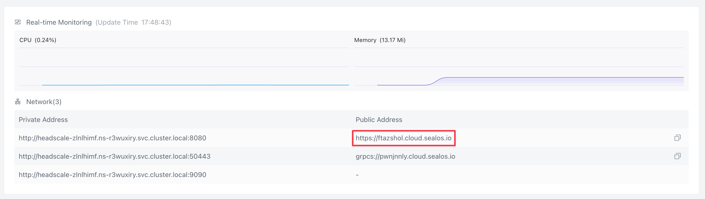
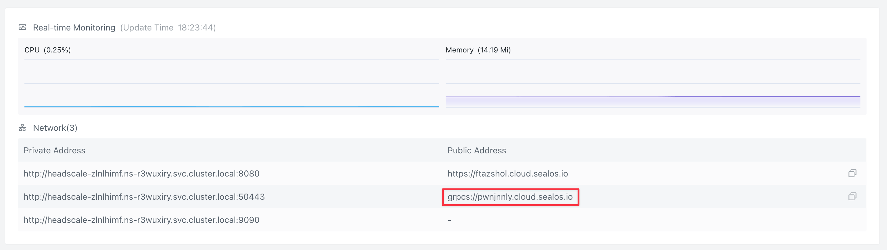

# Running headscale on Sealos

!!! warning "Community documentation"

    This page is not actively maintained by the headscale authors and is
    written by community members. It is _not_ verified by `headscale` developers.

    **It might be outdated and it might miss necessary steps**.

## Goal

This documentation has the goal of showing a user how-to run `headscale` on Sealos.

## Running headscale server

1. Click the following prebuilt template(version [0.23.0-alpha2](https://github.com/juanfont/headscale/releases/tag/v0.23.0-alpha2)):

   [](https://cloud.sealos.io/?openapp=system-template%3FtemplateName%3Dheadscale)

2. Click "Deploy Application" on the template page to start deployment. Upon completion, two applications appear: Headscale, and its [visual interface](https://github.com/GoodiesHQ/headscale-admin).
3. Once deployment concludes, click 'Details' on the Headscale application page to navigate to the application's details.
4. Wait for the application's status to switch to running. For accessing the headscale server, the Public Address associated with port 8080 is the address of the headscale server. To access the Headscale console, simply append `/admin/` to the Headscale public URL.

   

5. Click on 'Terminal' button on the right side of the details to access the Terminal of the headscale application. then create a user ([tailnet](https://tailscale.com/kb/1136/tailnet/)):

   ```bash
   headscale users create myfirstuser
   ```

### Register a machine (normal login)

On a client machine, execute the `tailscale` login command:

```bash
# replace <YOUR_HEADSCALE_URL> with the public domain provided by Sealos
tailscale up --login-server YOUR_HEADSCALE_URL
```

To register a machine when running headscale in [Sealos](https://sealos.io), click on 'Terminal' button on the right side of the headscale application's detail page to access the Terminal of the headscale application, then take the headscale command:

```bash
headscale --user myfirstuser nodes register --key <YOU_+MACHINE_KEY>
```

### Register machine using a pre authenticated key

click on 'Terminal' button on the right side of the headscale application's detail page to access the Terminal of the headscale application, then generate a key using the command line:

```bash
headscale --user myfirstuser preauthkeys create --reusable --expiration 24h
```

This will return a pre-authenticated key that can be used to connect a node to `headscale` during the `tailscale` command:

```bash
tailscale up --login-server <YOUR_HEADSCALE_URL> --authkey <YOUR_AUTH_KEY>
```

## Controlling headscale with remote CLI

This documentation has the goal of showing a user how-to set control a headscale instance from a remote machine with the headscale command line binary.

### Create an API key

We need to create an API key to authenticate our remote headscale when using it from our workstation.

To create a API key, click on 'Terminal' button on the right side of the headscale application's detail page to access the Terminal of the headscale application, then generate a key:

```bash
headscale apikeys create --expiration 90d
```

Copy the output of the command and save it for later. Please note that you can not retrieve a key again, if the key is lost, expire the old one, and create a new key.

To list the keys currently assosicated with the server:

```bash
headscale apikeys list
```

and to expire a key:

```bash
headscale apikeys expire --prefix "<PREFIX>"
```

### Download and configure `headscale` client

1. Download the latest [`headscale` binary from GitHub's release page](https://github.com/juanfont/headscale/releases):

2. Put the binary somewhere in your `PATH`, e.g. `/usr/local/bin/headscale`

3. Make `headscale` executable:

```shell
chmod +x /usr/local/bin/headscale
```

4. Configure the CLI through Environment Variables

```shell
export HEADSCALE_CLI_ADDRESS="<HEADSCALE ADDRESS>:443"
export HEADSCALE_CLI_API_KEY="<API KEY FROM PREVIOUS STAGE>"
```

In the headscale application's detail page, The Public Address corresponding to port 50443 corresponds to the value of <HEADSCALE ADDRESS>.



for example:

```shell
export HEADSCALE_CLI_ADDRESS="pwnjnnly.cloud.sealos.io:443"
export HEADSCALE_CLI_API_KEY="abcde12345"
```

This will tell the `headscale` binary to connect to a remote instance, instead of looking
for a local instance.

The API key is needed to make sure that your are allowed to access the server. The key is _not_
needed when running directly on the server, as the connection is local.

1. Test the connection

Let us run the headscale command to verify that we can connect by listing our nodes:

```shell
headscale nodes list
```

You should now be able to see a list of your nodes from your workstation, and you can
now control the `headscale` server from your workstation.

> Reference: [Headscale Deployment and Usage Guide: Mastering Tailscale's Self-Hosting Basics](https://icloudnative.io/en/posts/how-to-set-up-or-migrate-headscale/)
