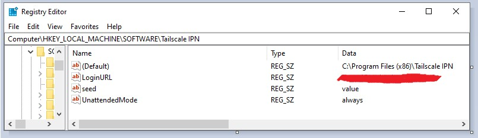

# Connecting a Windows client

## Goal

This documentation has the goal of showing how a user can use the official Windows [Tailscale](https://tailscale.com) client with `headscale`.

## Add registry keys

To make the Windows client behave as expected and to run well with `headscale`, two registry keys **must** be set:

- `HKLM:\SOFTWARE\Tailscale IPN\UnattendedMode` must be set to `always` as a `string` type, to allow Tailscale to run properly in the background
- `HKLM:\SOFTWARE\Tailscale IPN\LoginURL` must be set to `<YOUR HEADSCALE URL>` as a `string` type, to ensure Tailscale contacts the correct control server.

You can set these using the Windows Registry Editor:



Or via the following Powershell commands (right click Powershell icon and select "Run as administrator"):

```
New-Item -Path "HKLM:\SOFTWARE\Tailscale IPN"
New-ItemProperty -Path 'HKLM:\Software\Tailscale IPN' -Name UnattendedMode -PropertyType String -Value always
New-ItemProperty -Path 'HKLM:\Software\Tailscale IPN' -Name LoginURL -PropertyType String -Value https://YOUR-HEADSCALE-URL
```

The Tailscale Windows client has been observed to reset its configuration on logout/reboot and these two keys [resolves that issue](https://github.com/tailscale/tailscale/issues/2798).

For a guide on how to edit registry keys, [check out Computer Hope](https://www.computerhope.com/issues/ch001348.htm).

## Installation

Download the [Official Windows Client](https://tailscale.com/download/windows) and install it.

When the installation has finished, start Tailscale and log in (you might have to click the icon in the system tray).

The log in should open a browser Window and direct you to your `headscale` instance.

## Troubleshooting

If you are seeing repeated messages like:

```
[GIN] 2022/02/10 - 16:39:34 | 200 |    1.105306ms |       127.0.0.1 | POST     "/machine/redacted"
```

in your `headscale` output, turn on `DEBUG` logging and look for:

```
2022-02-11T00:59:29Z DBG Machine registration has expired. Sending a authurl to register machine=redacted
```

This typically means that the registry keys above was not set appropriately.

To reset and try again, it is important to do the following:

1. Ensure the registry keys from the previous guide is correctly set.
2. Shut down the Tailscale service (or the client running in the tray)
3. Delete Tailscale Application data folder, located at `C:\Users\<USERNAME>\AppData\Local\Tailscale` and try to connect again.
4. Ensure the Windows node is deleted from headscale (to ensure fresh setup)
5. Start Tailscale on the windows machine and retry the login.
